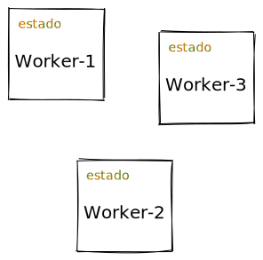
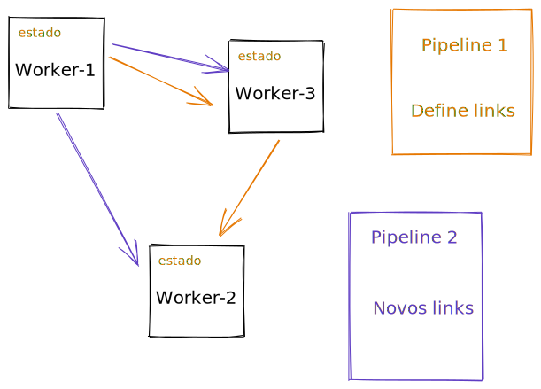

# Unit

Biblioteca para processamento assíncrono de forma fácil

# Funcionamento

A forma como os Workers são implementados, utilizam `threads` reais do computador e dessa forma compartilham mensagens de forma extremamente eficiente e.g. via memória. Assim, o número de steps (workers) para modelar uma tarefa mais complexa não deve ser impedimento para construir quantos workers forem necessários.

## Workers

 

*Workers* são unidades de processamento bem definidas. Cada *worker* precisa receber uma mensagem com os dados necessários para iniciar a sua operação. Um worker tem um *estado* interno e pode enviar 1 ou mais mensagens para o próximo worker que estiver conectado. Esse controle é feito pelos valores de retorno do worker.

Todos os workers deverem retornar um vetor e.g. `[estado valor1 valor2 ...]`.

1. Caso você queira manter informação no estado do worker, atualize o estado atual e passe como primeiro valor do vetor de retorno
2. Caso você queira manter o mesmo estado do worker, passe o estado atual como primeiro valor do vetor de retorno
3. Caso queira retornar um valor para o próximo worker, passe da segunda posição em diante
4. Caso não queira retornar nada para o próximo worker, passe somente um valor com o estado.

## Pipelines

 

Os *Pipelines* são descrições dinâmicas de como conectar os *Workers* e formar uma linha de execução para concluir uma tarefa especifica. É importante notar que o mesmo *worker* pode fazer parte de vários pipelines e se comunicar de forma isolada da maneira como for definida.
